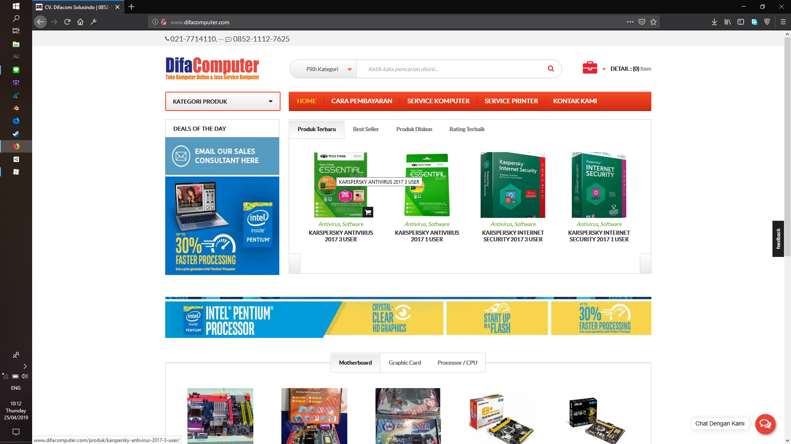
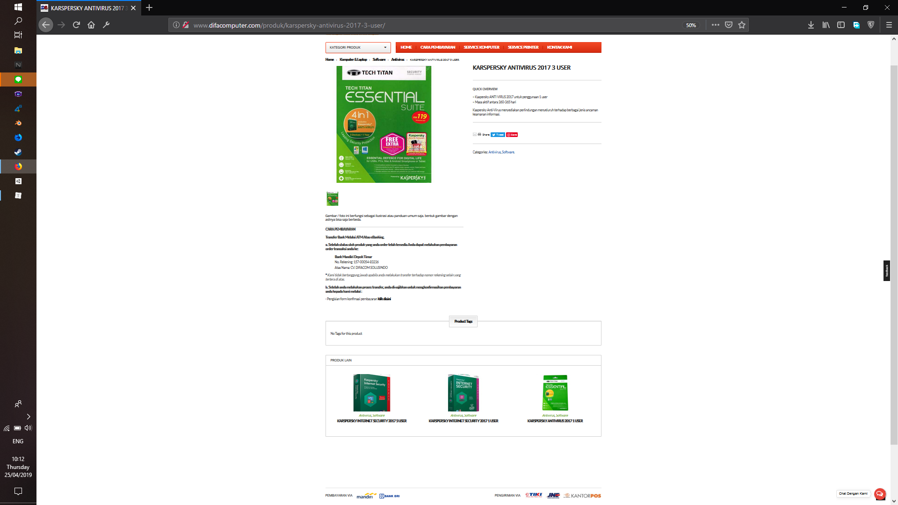
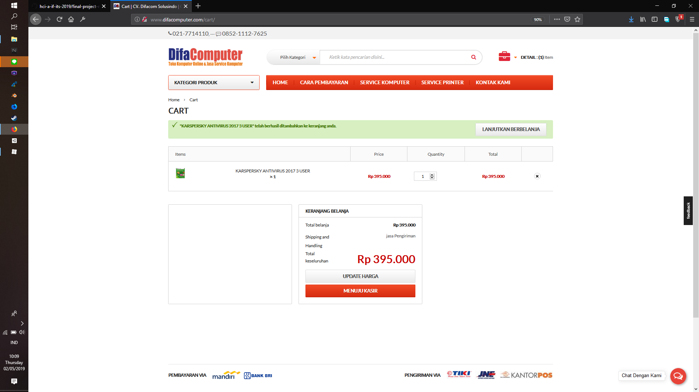

# Final Project - HCI A

#### Menantu Idaman

- Safhira Maharani										  05111740000027
- Nur Muhammad Husnul Habib Yahya	  05111740000094
- Wildan Ghiffarie Budhi								05111740000184

## Project Topic

The topic of our final project will be about [difacomputer](www.difacomputer.com) This web is an e-commerce web, that sells *IT Things.* Here's what it looks like :

TBA

###### What Parts of This Web That We Think is Bad

- No Buy or Add to Cart Button

  If we click the item for detailed information, there is no buy or add to cart button in that page. We need to go back to page that is showcasing all item.

  

  

  For this, we think that even in the item details, there should be a button to add the item to the cart. This way, the user won't have to go back to previous page to add it to the cart.

- No Price Tag

  In the showcase page or item details, there is no information of the item's price. We won't know how much the item's price is until we add it to the cart and then go to our cart page. The only place the price is showing is that page.

  You can look at image above, that there is no single information about the price of the item, but when you add it to the cart and go to the cart page it shows.
  
  
  
  For this, we think that it should show the item price tag because it is one of the most important information that buyer needs. It will be irritating to know the item's price only when we add the item to the cart.
  
 ## Contextual Inquiry
 ### Description website
 ### Instruction Script
 #### Question
 * Have you ever to buy something online?
 * How to operate it?
 * Have you ever try to buy something in difacomputer.com website?

 #### Instruction
 
 * Try to search a laptop : Lenovo G50-70-1558
 * Find out what processor that laptop has
 * Add that laptop to the cart
 * Try to search : KARSPERSKY ANTIVIRUS 2017 3 USER 
 * Try to find that item’s price
 * Add that item to the cart

 ### User Description
 #### User 1
 * User is a student in State Administration UNAIR
* User is a female.
* She is 21 years old
* She has experience using a website to shopping, look her GPA in UNAIR website and do her homework. 

 #### User 2
 * User is a student in Industrial Engineering ITS
  * User is a male
  * He is 19 years old
  * He has experience using a website to shopping, do his homework and read a comic

 #### User 3
 
 * User is a student in Psychology UNAIR
	* User is a female
	* She is 19 years old
	* She has experience using a website for do her homework and shopping.

 #### User 4
 
* User is a student in Public Health UNAIR
	* User is a female
	* She is 22 years old
	* She has experience in online shopping

 #### User 5
 
 * User is a male
	* He is a student in Informatics Departement  ITS
	* He is 20 years old
	* He has experience to using a website for shopping in Itemku.com, Bukalapak, Shopee.

 ### Transcprit
 #### User 1
 1.	Me	: “Jadi ini adalah sebuah website punya orang lain sih, nanti aku akan kasih kamu beberapa pertanyaan sama instruksi, nanti kamu melakukan apa yang aku instruksi kan. Kalo bisa sih, setiap kamu melakukan instruksi , kamu deskripsiin gitu, kamu mencet tombol apa, trus kamu ngapain. Misal kalo aku nyuruh kamu membuat akun. Brati nanti klik tombol Register terus nanti isiin input. Trus klik register, gitu yaa.”
2.	User1	: “Oke fhira..”
3.	Me	: “Okay, pertanyaan pertama, apakah kamu pernah membeli barang atau sesuatu secara online?”
4.	User1	: “Pernah,pake Shopee”
5.	Me	: “Terus gimana cara mengoperasikan itu?”
6.	User1	: “Awalnya buat akun, terus cari barangnya, pilih check out,terus masukkan alamat, melakukan pembayaran, barang dikirim”
7.	Me	: “Okay, apakah kamu pernah membeli barang di website ini?”
8.	User1	: “Tidakk”
9.	Me	: “Brati ini first impression mu ya”
10.	User1	: “Iya..”
11.	Me	: “Okay, langsung ke instrusksi pertama. Cari sebuah laptop LENOVO G50-70-1558”
12.	(user menekan tombol Pilih Kategori)
13.	(user mencari pilihan LENOVO)
14.	User1	: “Kok ini pilihan lenovo nya ada 3 yaa, Cuma beda di huruf besar sama kecilnya aja.”
15.	Me	: “Oiya ya”
16.	(user menekan tombol Lenovo)
17.	User1	: “hmm kok ga muncul apa apa ya. Oh coba aku isi input di sini (user menunjuk input search bar). Trus di klik tombol search ini”
18.	Me	: “Okay”
19.	User1	: “Wa ini ketemu”
20.	Me	: “Okay, instruksi selanjutnya. Coba kamu cari tau tentang processor yang digunakan di laptop itu.”
21.	(user mencari satu persatu dengan membaca setiap tempat)
22.	User1	: “Owalah ini ini”
23.	(user terlihat sedang berpikir)
24.	Me	: “Kenapa ? Kamu lagi mikirin apa?”
25.	User1	: “Hmm. Menurutku saya ini design nya terlihat kaku ya. Jadinya kayak membosankan. Terus juga ini tulisannya juga kayak Bapak-bapak banget berasa kuno jadinya kayak kurang variasi gitu.”
26.	Me	: “Okay, coba sekarang tambahkan laptop itu ke cart”
27.	(user terlihat bingung untuk mencari tombol untuk menambahkan laptop itu ke cart)
28.	User1	: “Mana ya , sek ya fhir”
29.	(user masih mencari tombol, sampai akhirnya user menyerah)
30.	Me	: “Gimana gimana ”
31.	User1	: “ga nemu fhir”
32.	Me	: “Kamu tadi kayak susah ya cari tombol tambahkan?”
33.	User1	: “iya  kayak susah, ga nemu aku fhir”
34.	Me	: “Terus menurutmu tombol cart nya tuh seharusnya ditaruh dimana?”
35.	User1	: “Menurutku nanti kalo udah tertarik sama barangnya, langsung bisa nge klik tombol tabah ke cart. Jadi ditaruh di tempat strategis kayak di bawah tulisan LENOVO atau dibawah Product Description.”
36.	Me	: “Okay instruksi selanjutnya, coba kamu cari sebuah antivirus KARSPERSKY ANTIVIRUS 2017 3 USER”
37.	(user menekan tombol Pilih Kategori dan mencari kategori ‘karspeksky’ lalu tidak menemukan.)
38.	(user mencari di search bar dengan memasukkan input ‘KARSPERSKY ANTIVIRUS 2017 3 USER’ lalu menekan tombol search. )
39.	User1	: “sek sek, jadi fungsinya Pilih Kategori itu apa ya, kalo ini tu gak semua merk ada di kategori terus yang tadi itu pilihan LENOVO ada tiga. Kan jadi kayak berulang gtu datanya. Pilih Kategori ga ada fungsinya jadinya malah bikin bingung.”
40.	Me	: “Oke coba kamu cari tau tentang harga antivirus itu”
41.	(user terlihat bingung mencari informasi harga dan mencari selama 1 menitan. )
42.	User1	: “aku nyerah fhir, emang ada ya tulisan harganya?”
43.	Me	: “iya ada”
44.	User1	: “kalo menurutku ya ini halaman nya kurang spesifik gitu, harusnya di bawah tulisan judul ini (karpeksky) itu ada harganya , dan tulisannya yang besar. Soalnya menurutku ya kalo misal kita tertarik sama suatu barang kita pasti cari dengan harga yang termurah dulu baru faktor-faktor yang lain. Trus dibawah barang itu product descrptionnya. Nah , kalo misal dia tertarik  beli, nanti di tombol paling bawah ada tombol kayak ‘Tambahkan ke Cart’ atau langsung checkout. Soalnya biasanya orang yang belanja online juga ga mau ribet gitu. Kalo ribet malah ga jadi beli.”
45.	Me	: “Wah mantap okeoke. Instruksi selanjutnya, coba kamu tambah antivirus itu ke cart”
46.	User1	: “Oke”
47.	(user mencari tombol tambah ke cart)
48.	(user terlihat bingung)
49.	User1	: “Uwis fhir, ga eruh aku. nyerah ”
50.	(user sudah menyerah setelah 2 menit mencari)
51.	Me	: “Oke, coba kamu kembali ke home”
52.	User1	: “Oke ini klik home.”
53.	Me	: “Coba cari lagi disitu.”
54.	(user mencari lagi tombol tambah ke cart di halaman home)
55.	User1	: “Oh ini(User menunjuk tombol tambah ke cart) fhir, kok kecil banget ya. Ini aneh si , kalo mau order masak harus buka halaman awal. Kalo menurutku , ditambahin disini juga gapapa tapi juga ditambah di halaman yang per barang itu. Ini ada harganya yang tadi aku ga nemu. Harusnya di halaman per barang juga ada.”
56.	Me	: “Oke, menurutmu dari keseluruhan website ini gimana?”
57.	User1	: “Iya, menurutku ini alurnya bingungi , terus harusnya di halaman per barang tadi lebih diatur aja penempatannya, bedain mana yang penting sama engga.”
58.	Me	: “Mantap. Oke udah wawancara nya, makasih yaa”

 #### User 2
 1.	Me	: “Jadi ini adalah sebuah website punya orang lain sih, nanti aku akan kasih kamu beberapa pertanyaan sama instruksi, nanti kamu melakukan apa yang aku instruksi kan. Kalo bisa sih, setiap kamu melakukan instruksi , kamu deskripsiin gitu, kamu mencet tombol apa, trus kamu ngapain. Misal kalo aku nyuruh kamu membuat akun. Brati nanti klik tombol Register terus nanti isiin input. Trus klik register, gitu yaa.”
2.	User2: “Oke fhir”
3.	Me	: “ okay, pertanyaan pertama. Apakah kamu pernah membeli barang atau sesuatu secara online?”
4.	User2	: “Pernah, beli di shopee lah jelas”
5.	Me	: “Gimana cara mengoperasikannya?”
6.	User2	: “Pertama tuh nge search mau beli apa, terus nanti diurutin , kalo aku sih biasanya diurutin yang termurah. Trus pilih barangnya, trus langsung checkout , trus bayar.”
7.	Me	: “Apakah kamu pernah membeli barang di website ini?”
8.	User2	: “Belum”
9.	Me	: “Brati ini first impression ya?”
10.	User2	: “Iya”
11.	Me	: “Okay, ke instruksi pertama , cari sebuah laptop LENOVO G50-70-1558”
12.	User2	: “Okay, ini ya (user menunjuk search bar dan mengisikan input nama barang yang akan dicari). Terus klik tombol ini, trus udah”
13.	Me	: “Okay. Coba kamu cari tau tentang prosessor yang digunakan di laptop itu.”
14.	User2	: “Ini Quick Overview, trus ini cara pemesanan. Oh ini Product Description. Terus ini processor nya.”
15.	Me	: “Okay, Coba tambahkan laptop itu ke cart”
16.	(user terlihat bingung untuk mencari tombol tambahkan ke cart)
17.	User2	: “hm susah juga. Ini ta ? Pengisian form konfirmasi pembayaran? (user menekan tombol ‘klik disini’)”
18.	User2	: “Eh bukan ding”
19.	(user kembali ke halaman produk (lenovo))
20.	(user mencari tombol tambahkan ke cart)
21.	User2	: “Gatau aku mba. Ga nemu aku. Kesusahan aku nyari tombol ini, mendingan tombolnya ditaruh di deket tulisan judulnya ‘Lenovo’ atau dibawah gambar sini, atau ga dibawah product description.”
22.	Me	: “Okay, coba lagi sebuah antivirus ‘KARSPERSKY ANTIVIRUS 2017 3 USER’ ”
23.	User2	: “Okay. Aku cari disini (user menunjuk ke search bar) trus klik tombol search”
24.	Me	: “Oke , instruksi selanjutnya coba kamu cari harga dari item tersebut”
25.	(user mulai mencari informasi harga dari barang tersebut dari halaman produk tersebut.)
26.	User2	: “hm mana ya.. ini ta? RM 119?”
27.	Me	: “bukan bukan”
28.	(user terlihat bingung untuk mencari informasi harga)
29.	User2	: “hm ... nomer rekening ada,  product tags ada. Oke ga nemu”
30.	(user menyerah)
31.	Me	: “Aku kasih clue ya. Coba kembali ke home”
32.	User2	: “oke”
33.	(user mencari lagi di halaman home)
34.	(user terlihat bingung untuk mencari harga sampai dibutuhkan waktu 2 menit)
35.	Me	: “Bingung ta?”
36.	User2	: “Iya mba, kayaknya ga ada deh mba informasi harganya, harusnya ya dibawah tulisan produknya sih. Aku ga nemu wes, nyerah”
37.	Me	: “Owalah okeoke. Aku kasih clue lagi, coba mouse nya diarahin ke gambar produknya.”
38.	User2	: “Oh ini ada tombol tambah ke cart. Klik tombol ini (tombol tambah ke cart). Oh disini harganya tapi harus tunjuk beli dulu. Susah cari harganya.”
39.	Me	: “Dari keseluruhan tadi itu, menurutmu kurangnya dimana aja?”
40.	User2	: “Di website ini tuh tidak menunjukkan secara utuh ke pembeli tetang harga trus cara pesennya gimana. Kayak ga jelas gitu. Kurang keep in touch with customer.”
41.	Me	: “Okay. Sekian wawancara nya, makasih yaa”

 
 #### User 3
 1.	Me	: “Jadi ini adalah sebuah website punya orang lain sih, nanti aku akan kasih kamu beberapa pertanyaan sama instruksi, nanti kamu melakukan apa yang aku instruksi kan. Kalo bisa sih, setiap kamu melakukan instruksi , kamu deskripsiin gitu, kamu mencet tombol apa, trus kamu ngapain. Misal kalo aku nyuruh kamu membuat akun. Brati nanti klik tombol Register terus nanti isiin input. Trus klik register, gitu yaa.”
2.	User3	: “iya mbak”
3.	Me	: “Okay pertanyaan nomer satu, apakah kamu pernah membeli barang atau sesuatu secara online?”
4.	User3	: “Pernah, di Shopee”
5.	Me	: “Caranya gimana itu?”
6.	User3	: “Cari di search kemudian dipilih barangnya kemudian klik tombol pilih barang trus menekan tombol pembelian”
7.	Me	: “Apakah kamu pernah membeli barang di website ini?”
8.	User3	: “belum pernah”
9.	Me	: “Brati ini baru pertama kali ya?”
10.	User3	: “Iya”
11.	Me	: “Oke langsung ke instruksi pertama aja, coba kamu cari sebuah laptop LENOVO G-50-70-1558 ”
12.	User3	: “Oke mbak. Disini (user menunjuk search bar). Trus ini ini diketik, kemudian di search”
13.	Me	: “Coba kamu cari informasi tetang processor yang digunakan di laptop itu.”
14.	(user mecari informasi tentang processor)
15.	User3	: “hm kok ga ada ya”
16.	(user mencari  lagi)
17.	User3: “Oh ini mbak processornya..”
18.	(user menunjuk dengan menggunakan jarinya)
19.	Me	: “Kok kamu keliatan susah gitu bacanya?”
20.	User3	: “Iya mba, jaraknya terlalu jauh menurut saya, jadinya sulit untuk dibaca”
21.	Me	: “Owalah gitu, oke instruksi selanjutnya, coba kamu tambahkan laptop itu ke cart”
22.	(user mencari tombol tambah ke cart)
23.	(user terlihat bingung karena waktu untuk mencari tombol tersebut lebih dari 1 menit)
24.	User3	: “Sini ta mbak?”
25.	Me	: “Yang mana? Yang atas itu? Bukan”
26.	(user mencari lagi)
27.	User3	: “Aku gatau mbak, aku engga nemu. Susah mbak carinya, tulisannya juga terlalu kecil dan ga jelas”
28.	(user masih mencari)
29.	User3	: “Inikah?”
30.	Me	: “Bukan.”
31.	User3	: “yaudah aku nyerah mbak. Harusnya sih tombol buat tambah ke cart ditaruh di bawah deskripsi langsung gitu. Jadi kalo orang mau beli dan sudah tertarik jadi bisa langsung beli ke arah pembelian gitu. Kalo begini malah orang nya ga jadi beli”
32.	Me	: “Oke, cari lagi sebuah antivirus ‘KARSPERSKY ANTIVIRUS 2017 3 USER’.”
33.	(user menunjuk ke search bar)
34.	(user mengetikkan ‘karspeesky antivirus 2017 3 user’)
35.	(user menekan tombol search)
36.	User3	: “Ini mbak”
37.	Me	: “Oke, cari tau tentang harga dari antivirus itu.”
38.	(user mencari informasi tentang harga)
39.	(user melakukan scroll ke atas lalu ke bawah lalu ke atas lagi. User terlihat bingung)
40.	User3	: “Kok ga ada di sini ?”
41.	Me	: “Coba cari lagi”
42.	(user mencari informasi tentang harga dari produk tersebut)
43.	User3	: “aku nyerah mbak. Di Quick Overview cuma ada penggunaan sama masa aktif aja, harusnya ada di sekitar sini”
44.	Me	: “Oh, berarti menurutmu ada di  bagian Quick Overview?”
45.	User3	: “Iya, soalnya orang tertarik pertama dari harganya, oh harganya segini, sesuai dengan budget atau enggak, biasanya gitu”
46.	Me	: “Oke instruksi selanjutnya, coba kamu tambah ke cart barang itu.”
47.	User3	: “Oke”
48.	(user mulai mencari tombol tambah ke cart atau troll)
49.	User3	: “Kayaknya ga ada mbak, sama kayak yang tadi”
50.	Me	: “Oke aku kasih clue ya. Coba kamu kembali ke home”
51.	User3	: “Oke mbak. Hmm ini barang yang tadi ya (user menunjuk gambar karspersky antivirus). Oh ini mbak buat nambah ke cart nya”
52.	(user menekan tombol troll)
53.	User3	: “Oh ini mbak harganya. Berarti kalau orang mau cari review nya dulu eh maksudnya detail produknya. Trus nanti tambah ke cart nya di halaman awal dong. Kok repot ya”
54.	Me	: “Iya.”
55.	Me	: “Udah segitu ajaa, makasih ya udah mau bantu”
56.	User3	: “Iya sama-sama mbak”

 
 #### User 4
 
 
 #### User 5
 1.	Me	: “Jadi ini adalah sebuah website punya orang lain sih, nanti aku akan kasih kamu beberapa pertanyaan sama instruksi, nanti kamu melakukan apa yang aku instruksi kan. Kalo bisa sih, setiap kamu melakukan instruksi , kamu deskripsiin gitu, kamu mencet tombol apa, trus kamu ngapain. Misal kalo aku nyuruh kamu membuat akun. Brati nanti klik tombol Register terus nanti isiin input. Trus klik register, gitu yaa.”
2.	User5	: “Oke fhir”
3.	Me	: “Oke ke pertanyaan pertama, apakah kamu pernah membeli barang atau sesuatu secara online?”
4.	User5	: “pernah. ”
5.	Me	: “Dimana?”
6.	User5	: “Di Bukalapak, Shopee”
7.	Me	: “Terus bagaimana cara kamu mengoperasikannya?”
8.	User5	: “Awalnya bikin akun dulu. Abis itu login. Terus cari barang yang di mau. Abis itu tekan beli. Terus nanti pilih pembayarannya. Terus bayar. Kalo sudah bayar, kita bisa lihat statusnya.”
9.	Me	: “Oke, apakah kamu pernah membeli barang atau sesuatu di difacomputer.com website?”
10.	User5	: “Belum pernah”
11.	Me	: “Berarti ini pertama kali ya?”
12.	User5	: “Iya.”
13.	Me	: “Terus instruksi pertama, coba kamu cari sebuah laptop LENOVO G-50-70-1558”
14.	User5	: “Jadi klik ini search boxnya, trus ketik lenovo g50 trus klik search. Terus keluar laptopnya”
15.	Me	: “Coba kamu cari processor yang digunakan di laptop itu.”
16.	(user mencari informasi processor laptop itu)
17.	User5	: “oh ini, processornya intel i5..”
18.	Me	: “Coba tambahkan laptop itu ke cart”
19.	User5	: “hm, tambahkan laptopnya ke cart”
20.	(user mencari tombol troll/tambah ke cart)
21.	User5	: “kok ga ada. Ini ta? Ketutupan. Eh, bukan.”
22.	(user terlihat bingung)
23.	(user mencari tombol troll/tambah ke cart)
24.	User5	: “Ini ga bisa masukin ke cart saya.”
25.	Me	: “Kenapa kok ga bisa?”
26.	User5	: “Ga nemu-nemu daritadi.”
27.	Me	: “Kalo menurutmu harusnya tombolnya ada dimana?”
28.	User5	: “Posisi strategisnya ini dibawah bagian Quick Overview. Jadi ada tombol tambahkan ke keranjang apa diatas kontaknya, karena ini di bawahnya ada tatacara pembayaran tapi ga ada cara gimana kita masukin itu ke keranjang. Jadi harus ngontact dulu ke orangnya. Kan ribet”
29.	Me	: “Malah ga jadi beli gitu ya?”
30.	User5	: “Iya malah beli di tempat lain. Harus telpon-telpon dulu, padahal kan tujuannya orang beli secara online tu biar lebih mudah dan cepat.”
31.	(user melihat bagian cara pembayaran)
32.	Me	: “Ada apa disitu?”
33.	User5	: “Ini sih di cara pembayarannya, font sama besar kecil hurufnya.  Terus mending dibuat lebih berwarna. Soalnya ini juga penting ini kalo misal kita transfer. Kalo misal warna hampir sama kayak ‘Gambar atau foto ini berfungsi kan jadi ga mudah terlihat.’. Kalo misal kita baca halaman ini secara cepat, ini ga bakal keliatan, soalnya monoton dan dianggap ga penting”
34.	Me	: “Oke, coba cari lagi sebuah antivirus ‘KARSPERSKY ANTIVIRUS 2017 3 USER’.”
35.	(user memasukkan input ke serach bar antivirus karspersky. Lalu menekan tombol search)
36.	User5	: “Loh, kok no data found”
37.	(user kembali ke halaman home)
38.	(user memasukkan input ke search bar karspersky 2017. Lalu menekan tombol search)
39.	User5	: “Loh, no data found”
40.	User5	: “Oh, jangan jangan ini harus mirip sama judul nya”
41.	(user memasukkan input KARSPERSKY ANTIVIRUS 2017 3 USER. Lalu menekan tombol search)
42.	User5	: “Nah ketemu. Hm, seenggak nya tadi waktu aku salah masukin input tuh diambil kata-kata yang mirip sama inputanku, jadi lebih mudah buat search nya. Mungkin kalo dari kategori produk bisa.”
43.	(user menekan tombol kategori produk)
44.	User5	: “Oh ternyata ga ada juga, berarti emang ga jualan antivirus ini.”
45.	Me	: “jualan”
46.	User5	: “owalah, jualan.”
47.	(user kembali ke halaman produk KARSPERSKY ANTIVIRUS 2017 3 USER.)
48.	Me	: “Coba cari tau tentang harganya.”
49.	(user mencari informasi tentang harga antivirus tersebut)
50.	User5	: “ga ada ini harganya”
51.	Me	: “Coba dicari lagi”
52.	(user mencari informasi tentang harga antivirus tersebut)
53.	User5 	: “Ini Cuma ada masa aktif , cara pembayaran, sama product tags. Ga ada fhir harganya”
54.	Me	: “Okay, menurutmu itu harganya seharusnya ditaruh dimana?”
55.	User5	: “Yang keliatan gitu, Judul trus dibawahnya langsung harga trus bawahnya quick overview trus dibawahnya klik tambahkan .”
56.	Me	: “Okay, coba kamu tambahkan ke cart”
57.	User5	: “Tadi sih di page yang lenovo ga ada, sek coba”
58.	(user mencari tombol tambah ke cart/troll)
59.	User5	: “ga ada wes fhir”
60.	Me	: “Aku kasih clue deh. Coba ke home”
61.	(user kembali ke halaman home)
62.	User5	: “Ada di halaman ini?”
63.	Me	: “Iya cari aja”
64.	(user terlihat bingung untuk mencari tombol troll)
65.	User5	: “Oh, iki ta? Astaga cilik tenan”
66.	(user menekan tombol troll)
67.	User5	: “Nah ini ada harganya juga.”
68.	Me	: “Iya”
69.	Me	: “Okay, udah gitu aja. Makasih yaaa”
70.	User5	: “ya, sama-sama”

 
 ### Model and Annotation
 #### Artifact Model
 #### Flow Model
 #### Cultural Model
 ### Do and Don't
 #### Do
 #### Don't
 

 ## Prototyping
 ### Sketch
 #### Sketch a page that have revised
 ### Freehand sketch on invisio
 ### High Fidelity Prototype
