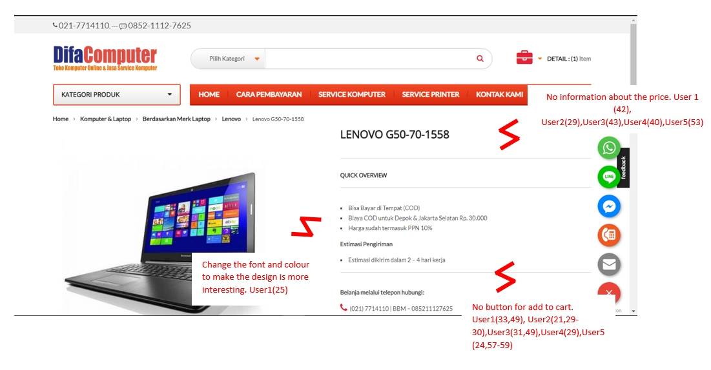
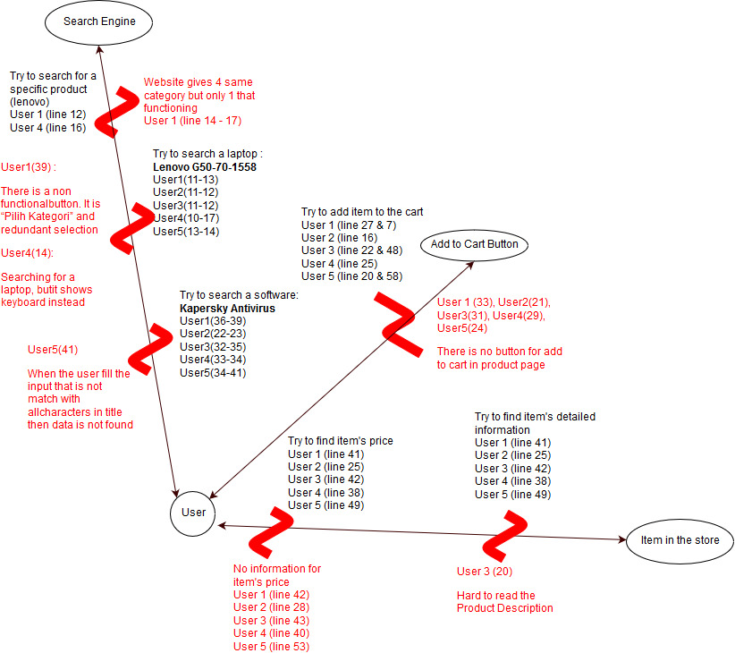

# Final Project - HCI A

#### Menantu Idaman

- Safhira Maharani										  05111740000027
- Nur Muhammad Husnul Habib Yahya	  05111740000094
- Wildan Ghiffarie Budhi								05111740000184


Table of contents

- [Project Topic](#project-topic)
- [Contextual Inquiry](#contextual-inquiry)
  - [Description Website](#description-website)
  - [Instruction Script](#instruction-script)
  - [User Description](#user-description)
  - [Transcript](#transcript)
  - [Model and Annotation](#model-and-annotation)
    - [Artifact Model](#artifact-model)
    - [Flow Model](#flow-model)
    - [Cultural Model](#cultural-model)
  - [Dos and Don'ts](#do-and-dont)
- [Prototyping](#prototyping)
  - [Sketch](#sketch)
  - [Versions Differences](#versions-differences)
  - [Selected Sketch](#selected-sketch)
  - [Prototype](#high-fidelity-prototype)


## Project Topic

The topic of our final project will be about [difacomputer](www.difacomputer.com) This web is an e-commerce web, that sells *IT Things.* Here's what it looks like :

TBA

###### What Parts of This Web That We Think is Bad

- No Buy or Add to Cart Button

  If we click the item for detailed information, there is no buy or add to cart button in that page. We need to go back to page that is showcasing all item.

  

  

  For this, we think that even in the item details, there should be a button to add the item to the cart. This way, the user won't have to go back to previous page to add it to the cart.

- No Price Tag

  In the showcase page or item details, there is no information of the item's price. We won't know how much the item's price is until we add it to the cart and then go to our cart page. The only place the price is showing is that page.

  You can look at image above, that there is no single information about the price of the item, but when you add it to the cart and go to the cart page it shows.
  
  
  
  For this, we think that it should show the item price tag because it is one of the most important information that buyer needs. It will be irritating to know the item's price only when we add the item to the cart.
  
 ## Contextual Inquiry
 ### Description website


Difacomputer.com is web e-commerce that provide some accessories computer, laptop, smartphone and etc. There are many thing for each categories that we can choose. For example, in laptop categories there are Asus, Lenovo, Acer, Dell, HP ,apple, etc that we can order from this website. Beside, we can know what product is best seller or the latest product.

 ### Instruction Script
 #### Question
 * Have you ever to buy something online?
 * How to operate it?
 * Have you ever try to buy something in difacomputer.com website?

 #### Instruction

 * Try to search a laptop : Lenovo G50-70-1558
 * Find out what processor that laptop has
 * Add that laptop to the cart
 * Try to search : KARSPERSKY ANTIVIRUS 2017 3 USER 
 * Try to find that item’s price
 * Add that item to the cart

 ### User Description
 #### User 1
 * User is a student in State Administration UNAIR
* User is a female.
* She is 21 years old
* She has experience using a website to shopping, look her GPA in UNAIR website and do her homework. 

 #### User 2
 * User is a student in Industrial Engineering ITS
  * User is a male
  * He is 19 years old
  * He has experience using a website to shopping, do his homework and read a comic

 #### User 3

 * User is a student in Psychology UNAIR
	* User is a female
	* She is 19 years old
	* She has experience using a website for do her homework and shopping.

 #### User 4

* User is a student in Public Health UNAIR
	* User is a female
	* She is 22 years old
	* She has experience in online shopping

 #### User 5

 * User is a male
	* He is a student in Informatics Departement  ITS
	* He is 20 years old
	* He has experience to using a website for shopping in Itemku.com, Bukalapak, Shopee.

 ### Transcript
 #### User 1

 ```
 1.	Me	: “Jadi ini adalah sebuah website punya orang lain sih, nanti aku akan kasih kamu beberapa pertanyaan sama instruksi, nanti kamu melakukan apa yang aku instruksi kan. Kalo bisa sih, setiap kamu melakukan instruksi , kamu deskripsiin gitu, kamu mencet tombol apa, trus kamu ngapain. Misal kalo aku nyuruh kamu membuat akun. Brati nanti klik tombol Register terus nanti isiin input. Trus klik register, gitu yaa.”
2.	User1	: “Oke fhira..”
3.	Me	: “Okay, pertanyaan pertama, apakah kamu pernah membeli barang atau sesuatu secara online?”
4.	User1	: “Pernah,pake Shopee”
5.	Me	: “Terus gimana cara mengoperasikan itu?”
6.	User1	: “Awalnya buat akun, terus cari barangnya, pilih check out,terus masukkan alamat, melakukan pembayaran, barang dikirim”
7.	Me	: “Okay, apakah kamu pernah membeli barang di website ini?”
8.	User1	: “Tidakk”
9.	Me	: “Brati ini first impression mu ya”
10.	User1	: “Iya..”
11.	Me	: “Okay, langsung ke instrusksi pertama. Cari sebuah laptop LENOVO G50-70-1558”
12.	(user menekan tombol Pilih Kategori)
13.	(user mencari pilihan LENOVO)
14.	User1	: “Kok ini pilihan lenovo nya ada 3 yaa, Cuma beda di huruf besar sama kecilnya aja.”
15.	Me	: “Oiya ya”
16.	(user menekan tombol Lenovo)
17.	User1	: “hmm kok ga muncul apa apa ya. Oh coba aku isi input di sini (user menunjuk input search bar). Trus di klik tombol search ini”
18.	Me	: “Okay”
19.	User1	: “Wa ini ketemu”
20.	Me	: “Okay, instruksi selanjutnya. Coba kamu cari tau tentang processor yang digunakan di laptop itu.”
21.	(user mencari satu persatu dengan membaca setiap tempat)
22.	User1	: “Owalah ini ini”
23.	(user terlihat sedang berpikir)
24.	Me	: “Kenapa ? Kamu lagi mikirin apa?”
25.	User1	: “Hmm. Menurutku saya ini design nya terlihat kaku ya. Jadinya kayak membosankan. Terus juga ini tulisannya juga kayak Bapak-bapak banget berasa kuno jadinya kayak kurang variasi gitu.”
26.	Me	: “Okay, coba sekarang tambahkan laptop itu ke cart”
27.	(user terlihat bingung untuk mencari tombol untuk menambahkan laptop itu ke cart)
28.	User1	: “Mana ya , sek ya fhir”
29.	(user masih mencari tombol, sampai akhirnya user menyerah)
30.	Me	: “Gimana gimana ”
31.	User1	: “ga nemu fhir”
32.	Me	: “Kamu tadi kayak susah ya cari tombol tambahkan?”
33.	User1	: “iya  kayak susah, ga nemu aku fhir”
34.	Me	: “Terus menurutmu tombol cart nya tuh seharusnya ditaruh dimana?”
35.	User1	: “Menurutku nanti kalo udah tertarik sama barangnya, langsung bisa nge klik tombol tabah ke cart. Jadi ditaruh di tempat strategis kayak di bawah tulisan LENOVO atau dibawah Product Description.”
36.	Me	: “Okay instruksi selanjutnya, coba kamu cari sebuah antivirus KARSPERSKY ANTIVIRUS 2017 3 USER”
37.	(user menekan tombol Pilih Kategori dan mencari kategori ‘karspeksky’ lalu tidak menemukan.)
38.	(user mencari di search bar dengan memasukkan input ‘KARSPERSKY ANTIVIRUS 2017 3 USER’ lalu menekan tombol search. )
39.	User1	: “sek sek, jadi fungsinya Pilih Kategori itu apa ya, kalo ini tu gak semua merk ada di kategori terus yang tadi itu pilihan LENOVO ada tiga. Kan jadi kayak berulang gtu datanya. Pilih Kategori ga ada fungsinya jadinya malah bikin bingung.”
40.	Me	: “Oke coba kamu cari tau tentang harga antivirus itu”
41.	(user terlihat bingung mencari informasi harga dan mencari selama 1 menitan. )
42.	User1	: “aku nyerah fhir, emang ada ya tulisan harganya?”
43.	Me	: “iya ada”
44.	User1	: “kalo menurutku ya ini halaman nya kurang spesifik gitu, harusnya di bawah tulisan judul ini (karpeksky) itu ada harganya , dan tulisannya yang besar. Soalnya menurutku ya kalo misal kita tertarik sama suatu barang kita pasti cari dengan harga yang termurah dulu baru faktor-faktor yang lain. Trus dibawah barang itu product descrptionnya. Nah , kalo misal dia tertarik  beli, nanti di tombol paling bawah ada tombol kayak ‘Tambahkan ke Cart’ atau langsung checkout. Soalnya biasanya orang yang belanja online juga ga mau ribet gitu. Kalo ribet malah ga jadi beli.”
45.	Me	: “Wah mantap okeoke. Instruksi selanjutnya, coba kamu tambah antivirus itu ke cart”
46.	User1	: “Oke”
47.	(user mencari tombol tambah ke cart)
48.	(user terlihat bingung)
49.	User1	: “Uwis fhir, ga eruh aku. nyerah ”
50.	(user sudah menyerah setelah 2 menit mencari)
51.	Me	: “Oke, coba kamu kembali ke home”
52.	User1	: “Oke ini klik home.”
53.	Me	: “Coba cari lagi disitu.”
54.	(user mencari lagi tombol tambah ke cart di halaman home)
55.	User1	: “Oh ini(User menunjuk tombol tambah ke cart) fhir, kok kecil banget ya. Ini aneh si , kalo mau order masak harus buka halaman awal. Kalo menurutku , ditambahin disini juga gapapa tapi juga ditambah di halaman yang per barang itu. Ini ada harganya yang tadi aku ga nemu. Harusnya di halaman per barang juga ada.”
56.	Me	: “Oke, menurutmu dari keseluruhan website ini gimana?”
57.	User1	: “Iya, menurutku ini alurnya bingungi , terus harusnya di halaman per barang tadi lebih diatur aja penempatannya, bedain mana yang penting sama engga.”
58.	Me	: “Mantap. Oke udah wawancara nya, makasih yaa”
 ```

 #### User 2

 ```
 1.	Me	: “Jadi ini adalah sebuah website punya orang lain sih, nanti aku akan kasih kamu beberapa pertanyaan sama instruksi, nanti kamu melakukan apa yang aku instruksi kan. Kalo bisa sih, setiap kamu melakukan instruksi , kamu deskripsiin gitu, kamu mencet tombol apa, trus kamu ngapain. Misal kalo aku nyuruh kamu membuat akun. Brati nanti klik tombol Register terus nanti isiin input. Trus klik register, gitu yaa.”
2.	User2: “Oke fhir”
3.	Me	: “ okay, pertanyaan pertama. Apakah kamu pernah membeli barang atau sesuatu secara online?”
4.	User2	: “Pernah, beli di shopee lah jelas”
5.	Me	: “Gimana cara mengoperasikannya?”
6.	User2	: “Pertama tuh nge search mau beli apa, terus nanti diurutin , kalo aku sih biasanya diurutin yang termurah. Trus pilih barangnya, trus langsung checkout , trus bayar.”
7.	Me	: “Apakah kamu pernah membeli barang di website ini?”
8.	User2	: “Belum”
9.	Me	: “Brati ini first impression ya?”
10.	User2	: “Iya”
11.	Me	: “Okay, ke instruksi pertama , cari sebuah laptop LENOVO G50-70-1558”
12.	User2	: “Okay, ini ya (user menunjuk search bar dan mengisikan input nama barang yang akan dicari). Terus klik tombol ini, trus udah”
13.	Me	: “Okay. Coba kamu cari tau tentang prosessor yang digunakan di laptop itu.”
14.	User2	: “Ini Quick Overview, trus ini cara pemesanan. Oh ini Product Description. Terus ini processor nya.”
15.	Me	: “Okay, Coba tambahkan laptop itu ke cart”
16.	(user terlihat bingung untuk mencari tombol tambahkan ke cart)
17.	User2	: “hm susah juga. Ini ta ? Pengisian form konfirmasi pembayaran? (user menekan tombol ‘klik disini’)”
18.	User2	: “Eh bukan ding”
19.	(user kembali ke halaman produk (lenovo))
20.	(user mencari tombol tambahkan ke cart)
21.	User2	: “Gatau aku mba. Ga nemu aku. Kesusahan aku nyari tombol ini, mendingan tombolnya ditaruh di deket tulisan judulnya ‘Lenovo’ atau dibawah gambar sini, atau ga dibawah product description.”
22.	Me	: “Okay, coba lagi sebuah antivirus ‘KARSPERSKY ANTIVIRUS 2017 3 USER’ ”
23.	User2	: “Okay. Aku cari disini (user menunjuk ke search bar) trus klik tombol search”
24.	Me	: “Oke , instruksi selanjutnya coba kamu cari harga dari item tersebut”
25.	(user mulai mencari informasi harga dari barang tersebut dari halaman produk tersebut.)
26.	User2	: “hm mana ya.. ini ta? RM 119?”
27.	Me	: “bukan bukan”
28.	(user terlihat bingung untuk mencari informasi harga)
29.	User2	: “hm ... nomer rekening ada,  product tags ada. Oke ga nemu”
30.	(user menyerah)
31.	Me	: “Aku kasih clue ya. Coba kembali ke home”
32.	User2	: “oke”
33.	(user mencari lagi di halaman home)
34.	(user terlihat bingung untuk mencari harga sampai dibutuhkan waktu 2 menit)
35.	Me	: “Bingung ta?”
36.	User2	: “Iya mba, kayaknya ga ada deh mba informasi harganya, harusnya ya dibawah tulisan produknya sih. Aku ga nemu wes, nyerah”
37.	Me	: “Owalah okeoke. Aku kasih clue lagi, coba mouse nya diarahin ke gambar produknya.”
38.	User2	: “Oh ini ada tombol tambah ke cart. Klik tombol ini (tombol tambah ke cart). Oh disini harganya tapi harus tunjuk beli dulu. Susah cari harganya.”
39.	Me	: “Dari keseluruhan tadi itu, menurutmu kurangnya dimana aja?”
40.	User2	: “Di website ini tuh tidak menunjukkan secara utuh ke pembeli tetang harga trus cara pesennya gimana. Kayak ga jelas gitu. Kurang keep in touch with customer.”
41.	Me	: “Okay. Sekian wawancara nya, makasih yaa”
 ```

 #### User 3

 ```
 1.	Me	: “Jadi ini adalah sebuah website punya orang lain sih, nanti aku akan kasih kamu beberapa pertanyaan sama instruksi, nanti kamu melakukan apa yang aku instruksi kan. Kalo bisa sih, setiap kamu melakukan instruksi , kamu deskripsiin gitu, kamu mencet tombol apa, trus kamu ngapain. Misal kalo aku nyuruh kamu membuat akun. Brati nanti klik tombol Register terus nanti isiin input. Trus klik register, gitu yaa.”
2.	User3	: “iya mbak”
3.	Me	: “Okay pertanyaan nomer satu, apakah kamu pernah membeli barang atau sesuatu secara online?”
4.	User3	: “Pernah, di Shopee”
5.	Me	: “Caranya gimana itu?”
6.	User3	: “Cari di search kemudian dipilih barangnya kemudian klik tombol pilih barang trus menekan tombol pembelian”
7.	Me	: “Apakah kamu pernah membeli barang di website ini?”
8.	User3	: “belum pernah”
9.	Me	: “Brati ini baru pertama kali ya?”
10.	User3	: “Iya”
11.	Me	: “Oke langsung ke instruksi pertama aja, coba kamu cari sebuah laptop LENOVO G-50-70-1558 ”
12.	User3	: “Oke mbak. Disini (user menunjuk search bar). Trus ini ini diketik, kemudian di search”
13.	Me	: “Coba kamu cari informasi tetang processor yang digunakan di laptop itu.”
14.	(user mecari informasi tentang processor)
15.	User3	: “hm kok ga ada ya”
16.	(user mencari  lagi)
17.	User3: “Oh ini mbak processornya..”
18.	(user menunjuk dengan menggunakan jarinya)
19.	Me	: “Kok kamu keliatan susah gitu bacanya?”
20.	User3	: “Iya mba, jaraknya terlalu jauh menurut saya, jadinya sulit untuk dibaca”
21.	Me	: “Owalah gitu, oke instruksi selanjutnya, coba kamu tambahkan laptop itu ke cart”
22.	(user mencari tombol tambah ke cart)
23.	(user terlihat bingung karena waktu untuk mencari tombol tersebut lebih dari 1 menit)
24.	User3	: “Sini ta mbak?”
25.	Me	: “Yang mana? Yang atas itu? Bukan”
26.	(user mencari lagi)
27.	User3	: “Aku gatau mbak, aku engga nemu. Susah mbak carinya, tulisannya juga terlalu kecil dan ga jelas”
28.	(user masih mencari)
29.	User3	: “Inikah?”
30.	Me	: “Bukan.”
31.	User3	: “yaudah aku nyerah mbak. Harusnya sih tombol buat tambah ke cart ditaruh di bawah deskripsi langsung gitu. Jadi kalo orang mau beli dan sudah tertarik jadi bisa langsung beli ke arah pembelian gitu. Kalo begini malah orang nya ga jadi beli”
32.	Me	: “Oke, cari lagi sebuah antivirus ‘KARSPERSKY ANTIVIRUS 2017 3 USER’.”
33.	(user menunjuk ke search bar)
34.	(user mengetikkan ‘karspeesky antivirus 2017 3 user’)
35.	(user menekan tombol search)
36.	User3	: “Ini mbak”
37.	Me	: “Oke, cari tau tentang harga dari antivirus itu.”
38.	(user mencari informasi tentang harga)
39.	(user melakukan scroll ke atas lalu ke bawah lalu ke atas lagi. User terlihat bingung)
40.	User3	: “Kok ga ada di sini ?”
41.	Me	: “Coba cari lagi”
42.	(user mencari informasi tentang harga dari produk tersebut)
43.	User3	: “aku nyerah mbak. Di Quick Overview cuma ada penggunaan sama masa aktif aja, harusnya ada di sekitar sini”
44.	Me	: “Oh, berarti menurutmu ada di  bagian Quick Overview?”
45.	User3	: “Iya, soalnya orang tertarik pertama dari harganya, oh harganya segini, sesuai dengan budget atau enggak, biasanya gitu”
46.	Me	: “Oke instruksi selanjutnya, coba kamu tambah ke cart barang itu.”
47.	User3	: “Oke”
48.	(user mulai mencari tombol tambah ke cart atau troll)
49.	User3	: “Kayaknya ga ada mbak, sama kayak yang tadi”
50.	Me	: “Oke aku kasih clue ya. Coba kamu kembali ke home”
51.	User3	: “Oke mbak. Hmm ini barang yang tadi ya (user menunjuk gambar karspersky antivirus). Oh ini mbak buat nambah ke cart nya”
52.	(user menekan tombol troll)
53.	User3	: “Oh ini mbak harganya. Berarti kalau orang mau cari review nya dulu eh maksudnya detail produknya. Trus nanti tambah ke cart nya di halaman awal dong. Kok repot ya”
54.	Me	: “Iya.”
55.	Me	: “Udah segitu ajaa, makasih ya udah mau bantu”
56.	User3	: “Iya sama-sama mbak”
 ```

 #### User 4

```
1. 	Me	: "Nah kan sampeyan wes tau tuku online"
2. 	User4	: "Iyo"
3. 	Me	: "Nangdi?"
4. 	User4	: "Bukalapak, tuku hp"
5. 	Me	: "Ndak takon tuku opo aku. Nah tau krungu website iki gak?"
6. 	User4	: "Ndak, blass. Opo iki? Difacomputer? Terus kudu lapo aku?"
7. 	Me	: "Coba sampeyan iku mencari produk lenovo g50-70"
8. 	User4	: "Hoo nggolek nang kene berarti, opo jenenge? Lenovo g50-70?"
9. 	Me	: "Iyo"
10.	(She search for that product using the search bar provided by the website)
11.	User4	: "Iki kan?"
12.	Me	: "Lah kok keyboard?"
13.	User4	: "Lah kudune opo?"
14.	Me	: "Laptop"
15. 	User4	: "Oh sek tak coba ngene berarti"
16. 	(she then clicked the category as laptop then search it again)
17. 	User4	: "Nah iki wes laptop"
18. 	Me	: "Coba kei wero aku opo processor laptope iku opo"
19. 	User4	: "Ha? opo iku processor?"
20. 	Me	: "Ono kok kudune tulisan e processor e opo"
21. 	User4	: "Iyo opo?"
22. 	Me	: "Pokok spesifikasine wes golekno"
23. 	User4	: "Sek, oh iki processor e intel core i5 dan -"
24. 	Me	: "Wes-wes cukup. Saiki coba masukno atau tambahno produk iki nang keranjang e sampeyan"
25. 	User4	: "Masukkan ke keranjang, oh iki keranjang"
26. 	(She clicked the cart button, not the add to cart button. So she is redirected to the cart page, not adding the product)
27. 	User4	: "Lah kok kosong, duduk tombol nambahno iku berarti mau. Kudune Add to Cart tapi kok gk ono"
28. 	Me	: "Golek maneh wes. Lek wes menyerah ngomong o"
29. 	(After searching for couple minutes she gave up)
30. 	User4	: "Nyerah aku wes"
31. 	Me	: "Oke wes lanjut, saiki coba golek Kapersky Antivirus 2017 3 User"
32. 	User4	: "Opo iku? oh antivirus a? sek sek"
33. 	(She search for it using search bar)
34. 	User4	: "Iki wes nemu"
35. 	Me	: "Coba saiki golek regone piro"
36. 	User4	: "Oke sek, nggolek nang website liyo gk ppo?"
37. 	Me	: "Yo gak lah, nang website iki"
38. 	User4	: "Oke wes sek."
39. 	(She searched for the item's price for a couple minutes until she gave up)
40. 	User4	: "Gak nemuuu, kok lucu gak ono harga ne see"
41. 	Me	: "Hahaha yaopo wes nyerah?"
42. 	User4	: "Apakah ini situs palsu? wahahaha"
43. 	Me	: "Nggaaakkk asli inii"
44. 	User4	: "Yowes nyerah wes"
45. 	Me	: "Cara kita agar tau harganya itu, kita tambahkan dulu ke keranjang, ntar di keranjang ditunjukin harganya"
46. 	User4	: "Kok lucu see, gak niat iki seng nggawe website, coba chat iki takon "Kenapa Add to Cart nya sama harganya disusahin pak""
47. 	Me	: "Lol, terus yaopo menurut sampeyan?"
48. 	User4	: "Mending daftar Shopee ae wes iki toko ne"
49. 	Me	: "Wahahaha, koyoke se iyo enak. Yowes iku tok suwun-suwun"
50. 	User4	: "Okeee"

```


 #### User 5

 ```
 1.	Me	: “Jadi ini adalah sebuah website punya orang lain sih, nanti aku akan kasih kamu beberapa pertanyaan sama instruksi, nanti kamu melakukan apa yang aku instruksi kan. Kalo bisa sih, setiap kamu melakukan instruksi , kamu deskripsiin gitu, kamu mencet tombol apa, trus kamu ngapain. Misal kalo aku nyuruh kamu membuat akun. Brati nanti klik tombol Register terus nanti isiin input. Trus klik register, gitu yaa.”
2.	User5	: “Oke fhir”
3.	Me	: “Oke ke pertanyaan pertama, apakah kamu pernah membeli barang atau sesuatu secara online?”
4.	User5	: “pernah. ”
5.	Me	: “Dimana?”
6.	User5	: “Di Bukalapak, Shopee”
7.	Me	: “Terus bagaimana cara kamu mengoperasikannya?”
8.	User5	: “Awalnya bikin akun dulu. Abis itu login. Terus cari barang yang di mau. Abis itu tekan beli. Terus nanti pilih pembayarannya. Terus bayar. Kalo sudah bayar, kita bisa lihat statusnya.”
9.	Me	: “Oke, apakah kamu pernah membeli barang atau sesuatu di difacomputer.com website?”
10.	User5	: “Belum pernah”
11.	Me	: “Berarti ini pertama kali ya?”
12.	User5	: “Iya.”
13.	Me	: “Terus instruksi pertama, coba kamu cari sebuah laptop LENOVO G-50-70-1558”
14.	User5	: “Jadi klik ini search boxnya, trus ketik lenovo g50 trus klik search. Terus keluar laptopnya”
15.	Me	: “Coba kamu cari processor yang digunakan di laptop itu.”
16.	(user mencari informasi processor laptop itu)
17.	User5	: “oh ini, processornya intel i5..”
18.	Me	: “Coba tambahkan laptop itu ke cart”
19.	User5	: “hm, tambahkan laptopnya ke cart”
20.	(user mencari tombol troll/tambah ke cart)
21.	User5	: “kok ga ada. Ini ta? Ketutupan. Eh, bukan.”
22.	(user terlihat bingung)
23.	(user mencari tombol troll/tambah ke cart)
24.	User5	: “Ini ga bisa masukin ke cart saya.”
25.	Me	: “Kenapa kok ga bisa?”
26.	User5	: “Ga nemu-nemu daritadi.”
27.	Me	: “Kalo menurutmu harusnya tombolnya ada dimana?”
28.	User5	: “Posisi strategisnya ini dibawah bagian Quick Overview. Jadi ada tombol tambahkan ke keranjang apa diatas kontaknya, karena ini di bawahnya ada tatacara pembayaran tapi ga ada cara gimana kita masukin itu ke keranjang. Jadi harus ngontact dulu ke orangnya. Kan ribet”
29.	Me	: “Malah ga jadi beli gitu ya?”
30.	User5	: “Iya malah beli di tempat lain. Harus telpon-telpon dulu, padahal kan tujuannya orang beli secara online tu biar lebih mudah dan cepat.”
31.	(user melihat bagian cara pembayaran)
32.	Me	: “Ada apa disitu?”
33.	User5	: “Ini sih di cara pembayarannya, font sama besar kecil hurufnya.  Terus mending dibuat lebih berwarna. Soalnya ini juga penting ini kalo misal kita transfer. Kalo misal warna hampir sama kayak ‘Gambar atau foto ini berfungsi kan jadi ga mudah terlihat.’. Kalo misal kita baca halaman ini secara cepat, ini ga bakal keliatan, soalnya monoton dan dianggap ga penting”
34.	Me	: “Oke, coba cari lagi sebuah antivirus ‘KARSPERSKY ANTIVIRUS 2017 3 USER’.”
35.	(user memasukkan input ke serach bar antivirus karspersky. Lalu menekan tombol search)
36.	User5	: “Loh, kok no data found”
37.	(user kembali ke halaman home)
38.	(user memasukkan input ke search bar karspersky 2017. Lalu menekan tombol search)
39.	User5	: “Loh, no data found”
40.	User5	: “Oh, jangan jangan ini harus mirip sama judul nya”
41.	(user memasukkan input KARSPERSKY ANTIVIRUS 2017 3 USER. Lalu menekan tombol search)
42.	User5	: “Nah ketemu. Hm, seenggak nya tadi waktu aku salah masukin input tuh diambil kata-kata yang mirip sama inputanku, jadi lebih mudah buat search nya. Mungkin kalo dari kategori produk bisa.”
43.	(user menekan tombol kategori produk)
44.	User5	: “Oh ternyata ga ada juga, berarti emang ga jualan antivirus ini.”
45.	Me	: “jualan”
46.	User5	: “owalah, jualan.”
47.	(user kembali ke halaman produk KARSPERSKY ANTIVIRUS 2017 3 USER.)
48.	Me	: “Coba cari tau tentang harganya.”
49.	(user mencari informasi tentang harga antivirus tersebut)
50.	User5	: “ga ada ini harganya”
51.	Me	: “Coba dicari lagi”
52.	(user mencari informasi tentang harga antivirus tersebut)
53.	User5 	: “Ini Cuma ada masa aktif , cara pembayaran, sama product tags. Ga ada fhir harganya”
54.	Me	: “Okay, menurutmu itu harganya seharusnya ditaruh dimana?”
55.	User5	: “Yang keliatan gitu, Judul trus dibawahnya langsung harga trus bawahnya quick overview trus dibawahnya klik tambahkan .”
56.	Me	: “Okay, coba kamu tambahkan ke cart”
57.	User5	: “Tadi sih di page yang lenovo ga ada, sek coba”
58.	(user mencari tombol tambah ke cart/troll)
59.	User5	: “ga ada wes fhir”
60.	Me	: “Aku kasih clue deh. Coba ke home”
61.	(user kembali ke halaman home)
62.	User5	: “Ada di halaman ini?”
63.	Me	: “Iya cari aja”
64.	(user terlihat bingung untuk mencari tombol troll)
65.	User5	: “Oh, iki ta? Astaga cilik tenan”
66.	(user menekan tombol troll)
67.	User5	: “Nah ini ada harganya juga.”
68.	Me	: “Iya”
69.	Me	: “Okay, udah gitu aja. Makasih yaaa”
70.	User5	: “ya, sama-sama”
 ```

 ### Model and Annotation
 #### Artifact Model





 #### Flow Model



 #### Cultural Model


 ### Do and Don't
 #### Do

- Add a button for add to cart in product or item page
- Add  a information about price of the product
- Move "Cara Pembayaran" to another page
- Change the button for add to cart in home page to make it bigger

 #### Don't

- Make a long space in product description in product or item page
- Show no functional button
- Make redundant selection

 ## Prototyping
 ### Sketch
 #### Solution 1


 #### Solution 2


 #### Solution 3


 ### Versions Differences
 #### Solution 1

In the first solution we designed the home page to show the hottest category first, so if we clicked the shop button it will redirect to the shopping page with that category selected. We also show the best seller product and featured product of the store. If we click the search button, it will show an overlay search bar with filter option to make the saerching more specific. We also added item's price and add to cart button in the item showcase. If we click the item it will redirect us to the item page.

In the shopping page there is a filter in the left bar to filter user search. Same here there are item's price and add to cart button, and if we click the item it will go to the item page.

In the item page there is an option to set number of item we will add to the cart. There are item's detail information, review of the item and discussion about the item. After that we also provide similar item at the bottom of item's information

 #### Solution 2

In the second solution, we designed the home page to show newest product, best seller product, products that on sale, and products with best rating. Unlike the first solution, in the home page there is already a filter in the left bar to filter products that are displayed in the page and only item's name and price that are displayed, no add to cart button. If we click the item we will redirected to the item page. If we click the saerch icon, there is an overlay to search for an item. and if we clicked the "?" icon there is an overlay of the website's contact, and help button to redirect user to the help page. 

In the item page we provide item's price and item's detailed information. We provide 2 buttons, one is Add to cart button if we want to buy something else too and one is Buy now button if we only want to buy that item.

In the help page, we got many kind of help, for example "Cara Pembayaran" in this section we will provide information on how to pay for the in this website after we purchase the item, and many more information.

 #### Solution 3

In the third solution we make the design more simple by only showing 1 featured product, hot new arrivals, and hot best sellers. Because for further shopping list we have shopping page that can be accessed from home page or via search engine.

The shopping page has filter menu in the left bar and shows what category are you searching for right now.

The search page has sort feature, so we can sort the items based on what we want, it got a filter menu too in the left bar.

The individual item page is the most simple, it only shows Name, details quantity to buy, price, and add to cart button.

 ### Selected Sketch

We select the solution 3 because we think its more simple in the design and we think that all of the 3 solutions will be functioning in the same way, because what the original website lacks are already solved in all solution. So thats why we choose solution 3 because the design is more simple.

 ### High Fidelity Prototype

[This is the link to our high fidelity prototype](http://wildangbudhi.ip-dynamic.com/IMK/)


## Usability Evaluation and Prototyping (Again)

### Operating The Prototype

[Link to our video about how to operate our prototype](https://youtu.be/Bsp__q8yubU)

### Part A: Usability Evaluation

#### 1. Brief Description of Participants

**User 1**

- User is a student in State Administration UNAIR
- User is a female.
- She is 21 years old
- She has experience using a website to shopping, look her GPA in UNAIR website and do her homework. 

**User 2**

- User is a student in Industrial Engineering ITS
- User is a male
- He is 19 years old
- He has experience using a website to shopping, do his homework and read a comic

**User 3**

- User is a student in Psychology UNAIR
- User is a female
- She is 19 years old
- She has experience using a website for do her homework and shopping.

**User 4**

- User is a student in Public Health UNAIR
- User is a female
- She is 22 years old
- She has experience in online shopping

**User 5**

- User is a male
- He is a student in Informatics Department  ITS
- He is 20 years old
- He has experience to using a website for shopping in Itemku.com, Bukalapak, Shopee.

**User 6**

- User is a male
- He is a student in Informatics Department ITS
- He is 20 years old
- He has experience in online shopping

#### 2. Evaluation Script

- Try to search a laptop : Lenovo G50-70-1558
- Find out what processor that laptop has
- Add that laptop to the cart
- Try to search : KARSPERSKY ANTIVIRUS 2017 3 USER 
- Try to find that item’s price
- Add that item to the cart

#### 3. Transcript

**User1**

```
1. Me         : “Jadi ini adalah sebuah website yang memperkaiki website yang kemaren itu.Nanti aku bakal kasih kamu beberapa instruksi trus kamu ngejalanin sama bilang apapun yang kamu lakukan.”
2. User1    : “oke”
3. Me         : “Coba kamu cari laptop lenovo”
4. User1    : “Ini , kita isi di kolom search lenovo trus klik tombol search”
5. User1    : “lah, oh ini ada”
6. User1    : “Trus aku pilih ini?Wah kok lemot internetnya, hm sek bentar-bentar”
7. (user terlihat bingung ketika menekan gambar hasil result)
8. User1    : “oh ini yang bisa di klik”
9. Me         : “Kenapa? Ada masalah?”
10. User1    : “Ini , sebaiknya kita juga bisa klik di gambar tombolnya”
11. Me         : “Okay. Oke selanjutnya, coba kamu cari tau prosessor yang  ada di laptop itu”
12. User1    : “Ini, Intel Core i7. Mantap ini lah, bagus-bagus daripada website yang kemaren”
13. Me         : “Oke, coba kamu tambah ke cart”
14. User1    : “Klik tombol ini”
15. (user melakukan klik ke tombol add to cart)
16. Me         : “Okay, coba kamu search lagi antivirus”
17. User1    : “ini kita isi di kolom search antivirus trus klik tombol search”
18. User1    : “ini ketemu hasilnya”
19. Me         : “okay. Coba kamu cari tau harganya”
20. User1    : “ini kan? 
21. (user melihat-lihat halaman product)
22. User1    : “Udah lengkap sih informasinya”
23. Me         : “Okay,Coba kamu tambah produk itu ke cart”
24. User1    : “klik tombol add to cart”
25. Me         : “Okay sudah, apakah tadi ada masalah?”
26. User1    : “Engga sih, cuman yang tadi aku udah bilang itu, yang tombol per product nya itu sekotak aja yang bisa di klik bukan Cuma di tulisannya”
27. Me         : “Oke apa lagi?”
28. User1    : “Udah sih itu aja. Secara keseluruhan udah bagus banget gak kayak yang kemaren itu.”
29. Me         : “Okay makasih ya”
```

**User2**

```
1. Me         : “Jadi ini adalah sebuah website yang memperkaiki website yang kemaren itu.Nanti aku bakal kasih kamu beberapa instruksi trus kamu ngejalanin sama bilang apapun yang kamu lakukan.”
2. User2    : “oke fhir”
3. Me         : “oke pertanyaan pertama, coba kamu cari laptop lenovo”
4. (user mengetikkan lenovo ke search bar)
5. (user melakukan klik tombol search)
6. User2    : “hah gaada? Eh ada deng, ini ada tulisan search result. Oh bener-bener ada”
7. Me         : “Okay, coba kamu cari tau informasi tentang processor dari laptop itu”
8. User2    : “Ini , intel core i7”
9. Me         : “Okay, coba kamu tambah produk itu ke cart”
10. User2    : “tambahin ke cart , ini tombol add to cart”
11. Me         : “Oke, coba kamu search lagi antivirus”
12. (user mengetik pada search bar)
13. (user menekan tombol search)
14. User2    : “ini fhir”
15. Me         : “Okay, cari tau tentang harga dari produk itu”
16. User2    : ”ini fhir”
17. Me        : “Okay, coba kamu tambah produk itu ke cart”
18. User2    : “antivirus yang mana ini?”
19. Me         : “terserah”
20. User2    : “ini halaman antivirusnya, trus ini klik tombol add to cart”
21. Me         : “secara keseluruhan, apa ada masalah?”
22. User2    : “udah bagus sih, tampilannya udah enak sih kayak startup-startup lain, trus mudah dioperasikan juga.”
23. Me         : “Ada lagi?”
24. User2    : “Udah itu aja.”
25. Me         : “Okay makasih ya”
26. User2    : “Sama-sama”
```

**User3**

```
1. Me         : “Jadi ini adalah sebuah website yang memperkaiki website yang kemaren itu.Nanti aku bakal kasih kamu beberapa instruksi trus kamu ngejalanin sama bilang apapun yang kamu lakukan.”
2. User3    : “oke fhir”
3. Me         : “Pertama, coba kamu cari laptop lenovo”
4. (user mengetikkan lenovo)
5. (user memilih kategori menjadi laptop)
6. (user menekan tombol search)
7. Me         : “Coba kamu cari informasi tentang processor dari laptop itu.”
8. User3    : “Oke, yang mana ini?”
9. Me         : “terserah kamu”
10. User3    : “eh seksek, kok ga bisa di klik ya?”
11. Me         : “ehh, hmm”
12. (user terlihat bingung)
13. User3    : “owalah, kok Cuma bisa di klik pas tulisannya doang.”
14. User3    : “ini , eh iya ini. Eh sek sek processor tuh yang kayak apa sih? Yang ini ga sih fhir? Intel Core i7?”
15. Me         : “Iya. Coba kamu tambah ke keranjang ”
16. User3    : “Iya ini klik tombol add to cart”
17. Me         : “Oke, coba kamu search lagi antivirus”
18. (user mengetikkan antivirus)
19. (user memilih kategori menjadi lain-lain)
20. (user menekan tombol search)
21. User3    : “ini fhira”
22. Me         : “Coba kamu cari informasi tentang harga dari produk itu”
23. User3    : “ini”
24. (user menunjuk pointer ke letak informasi harga)
25. Me         : “Coba kamu tambah produk itu ke cart”
26. User3    : “Ini klik tombol add to cart”
27. Me         : “secara keseluruhan, apakah ada masalah?”
28. User3    : “ketika mau ngeklik per produk nya itu harus tulisannya, aku pikir di gambarnya bisa. Itu sih tadi yang bikin bingung.”
29. User3    : “Udah bagus kok ini, mudah dimengerti..Iya udah bagus kok”
30. Me         : “Oke makasih ya”
31. User3    : “Sama-sama”   
```

**User4**

```
1. Me : "Kan sampeyan wes nyoba difacomputer.com wingi"
2. Her : "Iyo, terus?"
3. Me : "Nah iki tim ku wes nggawe desain prototype website sing luwih apik"
4. Her : "Oke, terus kudu lapo aku?"
5. Me : "Coba saiki search laptop lenovo koyok wingi"
6. Her : "Oke"
7. (User clicked the category dropdown, but then user typed lenovo in the search bar and then press Enter)
8. Her : "Wes iki ketemu"
9. Me : "Coba kei wero aku detail informasi barang e"
10. (User clicked the item's image for a few times,  then try to click on the item's name)
11. Her : "Hoo kudu jeneng e to, iki detail informasine"
12. Me : "Oke sip, tambahno item iku nang keranjang pembelian"
13. (User clicked on the Add to Cart Button)
14. Her : "Wes iki, lah kok Macbook?"
15. Me : "Yo kan iki sek prototype, durung full implementasi kabeh fungsi"
16. Her : "Oalah oke, terus kudu lapo? nggolek antivirus koyok wingi sisan?"
17. Me : "Iyo sip, golek en wes"
18. (User typed antivirus in the search bar then press Enter)
19. Her : "Milih sing endi iki? ono 3"
20. Me : "Pilih sing Kapersky 3 User"
21. (User click the item's name)
22. Her : "Terus?"
23. Me : "Hargane piro?"
24. Her : "Dek kene tulisane 2000, cek murah e"
25. Me : "Yo jeneng e data dummy"
26. Her : "Oke wes terus ditambah nang keranjang sisan?"
27. Me : "Iyes"
28. (User then clicked the Add to Cart Button)
29. Her : "Terus yaopo?"
30. Me : "Uwes se. Menurut sampeyan yaopo?"
31. Her : "Coba dek kategori ne iku ono sub kategori sisan, dadi misal kategori laptop, ono sub kategori acer, lenovo, bla bla bla"
32. Me : "Nah kan iki ono halaman cara pembayaran, mending dideleh dewe ngene dadi halaman dewe, opo koyok sing website iku?"
33. Her : "Koyok opo lek sing dek web asline?"
34. Me : "Dek halaman per item ono cara pembayaran"
35. Her : "Mending ngene sih, luwih enak gk ngakeh-akehi tulisan dek halaman per item."
36. Me : "Oke wes, wes mari suwun suwun"
```

**User5**

```
1. Me         : “Jadi ini adalah sebuah website yang memperkaiki website yang kemaren itu.Nanti aku bakal kasih kamu beberapa instruksi trus kamu ngejalanin sama bilang apapun yang kamu lakukan.”
2. User5    : “oke fhir”
3. Me         : “Coba kamu search laptop lenovo”
4. (user mengetik laptop lenovo pada search bar)
5. (user menekan tombol search)
6. User5    : “Eh kok ga keluar? Eh bentar-bentar lenovo kok tadi ya”
7. (user mengetik lenovo pada search bar)
8. (user menekan tombol search)
9. User5    : “ini fhir”
10. Me         : “Oke, Coba kamu cari tau informasi tentang processor dari laptop itu”
11. (user mencoba untuk menekan tombol yang akan mengarah ke halaman per produk)
12. (user terlihat bingung)
13. User5    : “kok ga bisa di klik yaa, apa ini internetnya yang lemot?”
14. Me         : “hmm”
15. (user mencoba untuk menekan tombol itu)
16. User5    : “oh, ini”
17. User5    : “ terus informasinya , ini fhir, inter core”
18. Me         : “Coba kamu tambahkan produk itu ke cart”
19. (user klik tombol add to cart)
20. User5    : “udah fhir”
21. Me         : “Coba kamu search lagi antivirus” 
22. (user mengetik antivirus pada search bar)
23. (user menekan tombol search)
24. User5    : “ini fhir”
25. Me         : “Coba kamu cari tau tentang harga dari produk itu”
26. User5    : “Kan udah ada disini? Oh iya ini hahaha”
27. Me         : “Okay, coba kamu tambahkan produk itu ke cart”
28. User5    : “ini klik tombol”
29. (user menunjuk ke tombol add to cart)
30. Me         : “Oke, secara keseluruhan tadi ada masalah ga?”
31. User5    : “ini sih , tadi itu waktu aku mau klik gambar trus dibawahnya ada tulisan produknya itu ga bisa. Jadi Cuma bisa di klik di tulisannya aja. Mendingan di gambarnya juga bisa di klik”
32. Me         : “Oke ada lagi?”
33. User5    : “Udah itu aja”
34. Me         : “Oke makasih ya”
35. User5    : “samasama fhir”
```

**User6**

```
1. Me : "Kau pernah belanja online gak?"
2. Him : "Udah lah"
3. Me : "Oke dah, ini aku kan punya suatu prototype web untuk belanja online. Aku ingin kau mencobanya."
4. Him : "Oke, nyoba gimana?"
5. Me : "Ntar kukasih instruksi kok sans"
6. Him : "Oke, terus pertama ngapain?"
7. Me : "Coba cari laptop lenovo g50"
8. (User typed lenovo in the search bar)
9. Him : "Yang g50?"
10. Me : "iyes"
11. (User clicked for several times in the item's image, then clicked on the intem's name)
12. Him : "Wah ini nih, gk enak kalau cuma bisa klik di nama."
13. Me : "Ya maap lupa, cari informasi nya"
14. Him : "Lah ini bisa kau baca sendiri"
15. Me : "Oke dah, sekarang tambahkan item nya ke cart"
16. (User clicked the Add to Cart button)
17. Him : "Lah kok macbook? jelek ini web nya"
18. Me : "Ya namanya prototype, jadi tidak semua fungsi diimplementasikan secara sempurna"
19. Him : "Jelek ini, jelek"
20. Me : "Ya apa kata kau dah. Sekarang coba cari Kapersky antivirus"
21. (User typed antivirus in the search bar, then press enter. Then proceed clicking the item's name for detailed information)
22. Him : "Dah nih"
23. Me : "Berapa harganya?"
24. Him : "2000 an"
25. Me : "Coba tambahkan ke keranjang juga"
26. (User click on the Add to Cart button)
27. Him : "Lah kok gk berubah cartnya? jelek ini jelek"
28. Me : "Kan tadi udah ku bilang oi"
29. Him : "Udah nih?"
30. Me : "Udah, menurutmu gimana?"
31. Him : "Ya kalau desain udah bagus sih, cuma tadi itu buat ke detail per item harusnya bisa diklik jgua gambarnya, jangan nama aja pokoknya."
32. Me : "Oke dah makasih-makasih"
```

#### 4. Feedback and Incidence Analysis

**Homepage**


- **Reference**: User 4 (line 7 & 31)
- **Feedback**: Very positive even if there is no spesific reference to the homepage. Only there is an advice where we should add sub-category in the category dropdown menu
- **Incidence**:  User tried to use the category feature but then decided not to.
- **Reason**: Having a sub-category will help user to be more spesific when searching for an item
- **Resolution**: Adding a sub-category besides the category

**Item Detail Page**


- **Reference**: -
- **Feedback**: -
- **Incidence**: -
- **Reason**: -
- **Resolution**: - 

**Search Page**


- **Reference**:

  User 1 (line 7)

  User 3 (line 10)

  User 4 (line 10)

  User 5 (line 11)

  User 6 (line 11)

- **Feedback**: We think its a positive one, bacause ther is only one advice for us. That is to make the image will redirect user to the item detail page too.

- **Incidence**: User can't open the item detail page by clicking the image.

- **Reason**: It's more easy when we also can click the image, not only the item's name

- **Resolution**: Making the image redirecting us to the item's page

**Cart Page**


- **Reference**: -
- **Feedback**: -
- **Incidence**: -
- **Reason**: -
- **Resolution:** -

**Cara Pembayaran Page**


- **Reference**: User4 (line 35)
- **Feedback**: Positive.
- **Incidence**: - 
- **Reason**: Its better this way (Cara Pembayaran has its own page) rather thatn adding Cara Pembayaran in the each item's detail page. So its making the item's detail page more simple.
- **Resolution**: -


### Part B: Prototyping (again)

#### Sketch for the changed screen

Here is the sketch for the category dropdown menu that we decided to change


We add sub-category if we clicked one of the category in the dropdown

#### Design Rationale

Having detailed feature for the user help them to operate the application. But we need to keep it simple, because the more simple it is, the better.

#### High-Fidelity Interactive-Prototype

[Link to our Prototype](http://wildangbudhi.ip-dynamic.com/IMK/index.html)